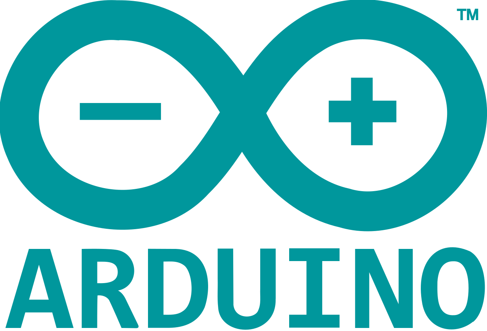

<br/>

<a>
   <p align="center">
      
      
   </p>
</a>
<br/>

# micro-ROS for Arduino

This is a micro-ROS library for baremetal projects based on Arduino IDE or Arduino CLI.

As the build process for ROS 2 and micro-ROS is based on custom meta-build system tools and [CMake](https://cmake.org/), this library is provided as a precompiled library. However, users can rebuild their own precompiled libraries in order to modify the micro-ROS configuration or [RMW parameters](https://micro.ros.org/docs/tutorials/advanced/microxrcedds_rmw_configuration/) by customizing the respective [.meta file](https://github.com/micro-ROS/micro_ros_arduino/tree/main/extras/library_generation).

- [micro-ROS for Arduino](#micro-ros-for-arduino)
  - [Supported boards](#supported-boards)
  - [How to use the precompiled library](#how-to-use-the-precompiled-library)
    - [Arduino IDE](#arduino-ide)
    - [PlatformIO](#platformio)
      - [Known issues](#known-issues)
  - [How to build the precompiled library](#how-to-build-the-precompiled-library)
  - [Patch Arduino board for support precompiled libraries](#patch-arduino-board-for-support-precompiled-libraries)
    - [Patch Teensyduino](#patch-teensyduino)
    - [Patch SAMD](#patch-samd)
  - [Purpose of the Project](#purpose-of-the-project)
  - [License](#license)
  - [Known Issues/Limitations](#known-issueslimitations)

## Supported boards

Supported boards are:

| Board                                                                               | Min version | State      | Details                                                                                             | .meta file               |
| ----------------------------------------------------------------------------------- | ----------- | ---------- | --------------------------------------------------------------------------------------------------- | ------------------------ |
| [Arduino Portenta H7 M7 Core](https://store.arduino.cc/portenta-h7)                 | v1.8.5      | Supported  | Official Arduino support                                                                            | `colcon.meta`            |
| [Arduino Nano RP2040 Connect](https://docs.arduino.cc/hardware/nano-rp2040-connect) | v1.8.5      | Supported  | Official Arduino support                                                                            | `colcon_verylowmem.meta` |
| [OpenCR](https://emanual.robotis.com/docs/en/parts/controller/opencr10/)            | v1.4.19     | Supported  | [Based on custom board](https://emanual.robotis.com/docs/en/parts/controller/opencr10/#arduino-ide) | `colcon.meta`            |
| [Teensy 4.0](https://www.pjrc.com/store/teensy40.html)                              | v1.8.5      | Not tested | [Based on Teensyduino](https://www.pjrc.com/teensy/td_download.html)                                | `colcon.meta`            |
| [Teensy 4.1](https://www.pjrc.com/store/teensy41.html)                              | v1.8.5      | Supported  | [Based on Teensyduino](https://www.pjrc.com/teensy/td_download.html)                                | `colcon.meta`            |
| [Teensy 3.2/3.1](https://www.pjrc.com/store/teensy32.html)                          | v1.8.5      | Supported  | [Based on Teensyduino](https://www.pjrc.com/teensy/td_download.html)                                | `colcon_lowmem.meta`     |
| [Teensy 3.5](https://www.pjrc.com/store/teensy35.html)                              | v1.8.5      | Not tested | [Based on Teensyduino](https://www.pjrc.com/teensy/td_download.html)                                | `colcon_lowmem.meta`     |
| [Teensy 3.6](https://www.pjrc.com/store/teensy36.html)                              | v1.8.5      | Supported  | [Based on Teensyduino](https://www.pjrc.com/teensy/td_download.html)                                | `colcon_lowmem.meta`     |
| [ESP32 Dev Module](https://docs.espressif.com/projects/arduino-esp32/en/latest/boards/ESP32-DevKitC-1.html) | v1.8.5  | Supported  | [Arduino core for the ESP32 (v2.0.2)](https://github.com/espressif/arduino-esp32/releases/tag/2.0.2) | `colcon.meta`   |

Community contributed boards are:

| Board                                                                                    | Min version | Contributor                                    | Details | .meta file               |
| ---------------------------------------------------------------------------------------- | ----------- | ---------------------------------------------- | ------- | ------------------------ |
| [Arduino Due](https://store.arduino.cc/arduino-due)                                      | -           | [@lukicdarkoo](https://github.com/lukicdarkoo) |         | `colcon_verylowmem.meta` |
| [Arduino Zero](https://store.arduino.cc/arduino-zero)                                    | -           | [@lukicdarkoo](https://github.com/lukicdarkoo) |         | `colcon_verylowmem.meta` |
| [Kakute F7](http://www.holybro.com/product/kakute-f7-aio-v1-5/)                          | -           | [@amfern](https://github.com/amfern)           |         | `colcon.meta`            |
| [STM32-E407](https://www.olimex.com/Products/ARM/ST/STM32-E407/resources/STM32-E407.pdf) | -           | [@dominikn](https://github.com/dominikn)       |         | `colcon.meta`            |

You can find the available precompiled ROS 2 types for messages and services in [available_ros2_types](available_ros2_types).

## How to use the precompiled library

### Arduino IDE

Go to [link to release section](https://github.com/micro-ROS/micro_ros_arduino/releases) and download the last release of micro-ROS library for Arduino.

Include it in your project using `Sketch -> Include library -> Add .ZIP Library...`

You can test micro-ROS examples located in this repo examples folder.

Remember that is possible to use a micro-ROS Agent just with this docker command:

```bash
# Serial micro-ROS Agent
docker run -it --rm -v /dev:/dev --privileged --net=host microros/micro-ros-agent:galactic serial --dev [YOUR BOARD PORT] -v6
```
### PlatformIO

For boards supported by micro-ROS, all you have to do to add the library to your project is including the following lines in the existing `platformio.ini` file:

```ini
[env:<YOUR_BOARD>]

...
lib_deps =
    https://github.com/micro-ROS/micro_ros_arduino

build_flags =
    -L ./.pio/libdeps/<YOUR_BOARD>/micro_ros_arduino/src/<BOARD_ARCHITECTURE>/
    -l microros
    -D <TARGET_DEFINITION>
```

| Board                       | <YOUR_BOARD>        | <BOARD_ARCHITECTURE>         | <TARGET_DEFINITION>                 |
| ----------------------------| ------------------- | ---------------------------- | ----------------------------------- |
| Arduino Portenta H7 M7 Core | portenta_h7_m7      | cortex-m7/fpv5-d16-softfp    | TARGET_PORTENTA_H7_M7               |
| Arduino Nano RP2040 Connect | nanorp2040connect   | cortex-m0plus                | ARDUINO_NANO_RP2040_CONNECT         |
| Teensy 4.1/4.0              | teensy41 / teensy40 | imxrt1062/fpv5-d16-hard      | ARDUINO_TEENSY41                    |
| Teensy 3.6                  | teensy36            | mk66fx1m0/fpv4-sp-d16-hard   | ARDUINO_TEENSY36                    |
| Teensy 3.5                  | teensy35            | mk64fx512/fpv4-sp-d16-hard   | ARDUINO_TEENSY35                    |
| Teensy 3.2  / 3.1           | teensy31            | mk20dx256                    | ARDUINO_TEENSY32 / ARDUINO_TEENSY31 |
| ESP32 Dev Module            | esp32dev            | esp32                        | ESP32                               |
| STM32-E407                  | olimex_e407         | cortex-m4                    | TARGET_STM32F4                      |
| Arduino Due                 | due                 | cortex-m3                    | -                                   |
| Arduino Zero                | zero                | cortex-m0plus                | -                                   |

Now to proceed with the PlatformIO workflow:

```bash
pio lib install # Install dependencies
pio run # Build the firmware
pio run --target upload # Flash the firmware
```

An example of a micro-ROS application using PlatformIO is available [here](https://github.com/husarion/micro_ros_stm32_template).

#### Known issues

- `multiple definition of` Link errors on galactic:

  Create a python script fix_linker.py on your directory and modify the linker flags manually:
  ```
  Import("env")
  env["_LIBFLAGS"] =  ('-Wl,--start-group -Wl,--whole-archive '
                      '${_stripixes(LIBLINKPREFIX, LIBS, LIBLINKSUFFIX, LIBPREFIXES, '
                      'LIBSUFFIXES, __env__)} -Wl,--no-whole-archive -lstdc++ '
                      '-lsupc++ -lm -lc -lgcc -lnosys -lmicroros -Wl,--end-group')
  ```

  Now add it to your `platformio.ini` like this: `extra_scripts = fix_linker.py` and delete the `-l libmicroros` line on `build_flags`.

  Related: https://github.com/micro-ROS/micro_ros_arduino/pull/848#issuecomment-1072196933, https://github.com/micro-ROS/micro_ros_arduino/issues/774

- Arduino Portenta H7
  - Follow **`multiple definition of` Link errors on galactic** modifications

    Related: https://github.com/micro-ROS/micro_ros_arduino/issues/847

- Arduino Nano RP2040 Connect

  - The following versioning shall be used:
    ```
    lib_deps =
      arduino-libraries/WiFiNINA@^1.8.13
      ...

    platform_packages =
      toolchain-gccarmnoneeabi @ ~1.70201.0
      framework-arduino-mbed @ ~2.4.1
    ```

  - Library dependency finder shall be set to `chain+`: `lib_ldf_mode = chain+`
  - Follow **`multiple definition of` Link errors on galactic** modifications

    Related: https://github.com/micro-ROS/micro_ros_arduino/issues/780

- Arduino Due
  - The following versioning shall be used:
    ```
    platform_packages =
      toolchain-gccarmnoneeabi@<1.50000.0
    ```

    Related: https://github.com/micro-ROS/micro_ros_arduino/issues/698

- ESP32 Dev Module
  - Known issues with espressif32 arduino package, use `2.0.2` version:
    ```
    [env:esp32dev]
    platform = https://github.com/platformio/platform-espressif32.git#feature/arduino-upstream
    board = esp32dev
    framework = arduino
    lib_deps =
        https://github.com/micro-ROS/micro_ros_arduino.git
    build_flags =
        -L ./.pio/libdeps/esp32dev/micro_ros_arduino/src/esp32/
        -l microros
        -D ESP32

    platform_packages =
      toolchain-xtensa32 @ ~2.80400.0
      framework-arduinoespressif32@https://github.com/espressif/arduino-esp32.git#2.0.2
    ```

    Related: https://github.com/micro-ROS/micro_ros_arduino/issues/736, https://github.com/platformio/platform-espressif32/issues/616

## How to build the precompiled library

If you need to add custom packages or types, or customize any internal parameter of the micro-ROS stack, you will need to recompile this library from source code:

```bash
docker pull microros/micro_ros_static_library_builder:galactic
docker run -it --rm -v $(pwd):/project --env MICROROS_LIBRARY_FOLDER=extras microros/micro_ros_static_library_builder:galactic
```

Optionally a specific single target can be built using the `-p <LIBRARY_TARGET>` argument like this:

```bash
docker run -it --rm -v $(pwd):/project --env MICROROS_LIBRARY_FOLDER=extras microros/micro_ros_static_library_builder:galactic -p <LIBRARY_TARGET>
```

Available targets `LIBRARY_TARGETS` are available on the [top of the extras/library_generation/library_generation.sh file](https://github.com/micro-ROS/micro_ros_arduino/blob/main/extras/library_generation/library_generation.sh#L13-L24)

Folders added to `extras/library_generation/extra_packages` and entries added to `extras/library_generation/extra_packages/extra_packages.repos` will be taken into account by this build system.
This should be used for example when adding custom messages types or custom micro-ROS packages.

You can [configure many parameters](https://micro.ros.org/docs/tutorials/advanced/microxrcedds_rmw_configuration/) of the library by editing the respective `.meta` file in the `extras/library_generation/` directory.

## Patch Arduino board for support precompiled libraries
### Patch Teensyduino

Go inside your Arduino + Teensyduino installation and replace `platform.txt`:

```bash
export ARDUINO_PATH=[Your Arduino + Teensiduino path]
cd $ARDUINO_PATH/hardware/teensy/avr/
curl https://raw.githubusercontent.com/micro-ROS/micro_ros_arduino/galactic/extras/patching_boards/platform_teensy.txt > platform.txt
```

### Patch SAMD

Go inside your Arduino + Teensyduino installation and replace `platform.txt`:

```bash
export ARDUINO_PATH=[Your Arduino path]
cd $ARDUINO_PATH/hardware/sam/1.6.12/
curl https://raw.githubusercontent.com/micro-ROS/micro_ros_arduino/galactic/extras/patching_boards/platform_arduinocore_sam.txt > platform.txt
```

## Purpose of the Project

This software is not ready for production use. It has neither been developed nor
tested for a specific use case. However, the license conditions of the
applicable Open Source licenses allow you to adapt the software to your needs.
Before using it in a safety relevant setting, make sure that the software
fulfills your requirements and adjust it according to any applicable safety
standards, e.g., ISO 26262.

## License

This repository is open-sourced under the Apache-2.0 license. See the [LICENSE](LICENSE) file for details.

For a list of other open-source components included in this repository,
see the file [3rd-party-licenses.txt](3rd-party-licenses.txt).

## Known Issues/Limitations

- When using provided precompiled libraries, users should take into account the already configured static memory pools in middleware layers. [More info here](https://micro.ros.org/docs/tutorials/advanced/microxrcedds_rmw_configuration/).
- micro-ROS transports should be refactored in order to provide a pluggable mechanisms. Only USB serial transports are provided.
- Teensyduino support files have to be patched in order to use precompiled libraries.
- To solve Python errors on ESP32 compilation: `apt install python-is-python3 && pip3 install pyserial`
